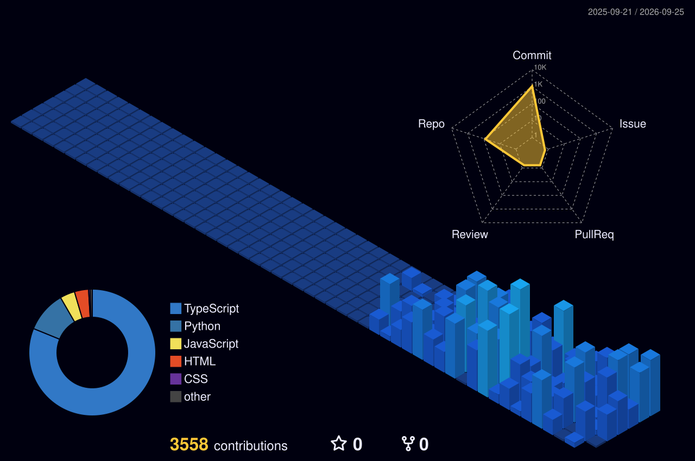

<!--
  github.com/white-venom  ·  profile README
  Assets are generated. Don't edit assets/ by hand — edit scripts/config.json and
  run `node scripts/gen-static.mjs`, or let the Action do it.
-->

<picture>
  <source media="(prefers-color-scheme: dark)" srcset="./assets/hero-dark.svg">
  <source media="(prefers-color-scheme: light)" srcset="./assets/hero-light.svg">
  
</picture>

I build products that go into production and stay there. Six live deployments, real
paying clients, one developer. Final-year **CSE (Cybersecurity)** at Bennett University,
**SDE Intern** at AFI Digital Services, and founder of [Tomoe](https://tomoe.agency).

<picture>
  <source media="(prefers-color-scheme: dark)" srcset="./assets/divider-dark.svg">
  
</picture>

## Stack

`Burp Suite` · `Kali Linux` · `OWASP Top 10` · `Wazuh` · `Razorpay` · `Hetzner`

<picture>
  <source media="(prefers-color-scheme: dark)" srcset="./assets/divider-dark.svg">
  
</picture>

## Work

<table>
<tr>
<td width="50%">
<a href="https://github.com/white-venom/vantix">
  <picture>
    <source media="(prefers-color-scheme: dark)" srcset="./assets/cards/vantix-dark.svg">
    
  </picture>
</a>
</td>
<td width="50%">
<a href="https://crediiflow.in">
  <picture>
    <source media="(prefers-color-scheme: dark)" srcset="./assets/cards/crediiflow-dark.svg">
    
  </picture>
</a>
</td>
</tr>
<tr>
<td width="50%">
<a href="https://tomoe.agency/work/gayatri-enterprises/">
  <picture>
    <source media="(prefers-color-scheme: dark)" srcset="./assets/cards/gayatri-dark.svg">
    
  </picture>
</a>
</td>
<td width="50%">
<a href="https://slotmedix.bizflows.in">
  <picture>
    <source media="(prefers-color-scheme: dark)" srcset="./assets/cards/slotmedix-dark.svg">
    
  </picture>
</a>
</td>
</tr>
</table>

Away from client work I build small, self-contained things and put them straight in the
browser — a perft-verified chess engine, a Thompson-NFA regex engine, a hand-written
autograd. **[The full build hub →](./PROJECTS.md)**

## How it fits together

<picture>
  <source media="(prefers-color-scheme: dark)" srcset="./assets/architecture-dark.svg">
  
</picture>

<picture>
  <source media="(prefers-color-scheme: dark)" srcset="./assets/divider-dark.svg">
  
</picture>

## Projects

<picture>
  <source media="(prefers-color-scheme: dark)" srcset="./assets/skyline-dark.svg">
  
</picture>

## Activity

<picture>
  <source media="(prefers-color-scheme: dark)" srcset="./assets/activity-dark.svg">
  
</picture>

<picture>
  <source media="(prefers-color-scheme: dark)" srcset="./assets/divider-dark.svg">
  
</picture>

## Security

CEH certified, and the same hands that ship these systems test them — OWASP Top 10
assessments, so I watch what lands against the stack I actually run in production.

<picture>
  <source media="(prefers-color-scheme: dark)" srcset="./assets/security-dark.svg">
  
</picture>

<picture>
  <source media="(prefers-color-scheme: dark)" srcset="./assets/divider-dark.svg">
  
</picture>

## Reach me

Hero, skyline, activity and CVE feed are regenerated by GitHub Actions. The numbers in the hero come from my own deployed systems — if an endpoint is down, it says so rather than showing a stale figure.
